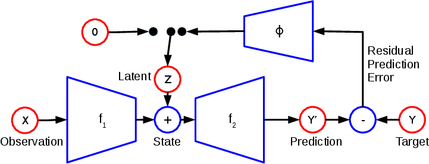

# Prediction under Uncertainty with Error-Encoding Networks

Code to train the models described in the paper ["Prediction under Uncertainty with Error-Encoding Networks"](<https://arxiv.org/abs/1711.04994>), by Mikael Henaff, Junbo Zhao and Yann LeCun. 

&nbsp;

&nbsp;



&nbsp;

&nbsp;


## Usage:


### Data

We provide all the datasets in one big file which can be downloaded [here](<https://drive.google.com/file/d/1Dzqv39yZ691i_F17qxxkPv4QA4Gayrxl/view?usp=sharing>). After downloading, you can extract it with:

```
tar -xvf een_data.tar.gz
```

You can also download the Poke dataset from the author's website [here](<http://ashvin.me/pokebot-website/>). If you use the Poke or TORCS dataset in a paper, please cite the original work [[1]](<https://arxiv.org/abs/1606.07419>)[[2]](<https://arxiv.org/abs/1605.06450>). 


### Training

The first step is to train the model in deterministic mode. This can be done with the following script

```
python train_een_deterministic.py -datapath /path/to/your/data -task breakout -save_dir /where/to/save/
```

You can change the task option to any of the other tasks. 
Once this is trained, you can train the model in its conditional mode with the desired number of latent variables by running:

```
python train_een_latent.py -datapath /path/to/your/data -task breakout -n_latent 2 -save_dir /where/to/save/
```

This script automatically loads the deterministic model weights from the folder specified with the -save_dir option, so make sure it is the same as in the previous script. 

To train on a new dataset, include a data loader file in the 'dataloaders' folder and add an entry to the file config.json specifying the image width, height, number of channels and so on. You will also need to specify the size of the hidden representation in the field 'phi_fc_size', which will ensure that the fully-connected part of the phi function is the right size. 

### Visualization

After training, you can run the script visualize.py which will generate frame predictions for different z vectors. 

``` 
python visualize.py -save_dir /path/to/models/
```

This will create a new directory for each model in the folder with the same name as the model file with '.viz' appended to it. This will contain one subfolder per set of conditioning frames, each with several generations using different z vectors. These are also saved as MP4 movie files for easier viewing. 

Examples of generated videos using the models in the trained_models folder can be found [here](<http://mikaelhenaff.net/eenvideos.html>). 